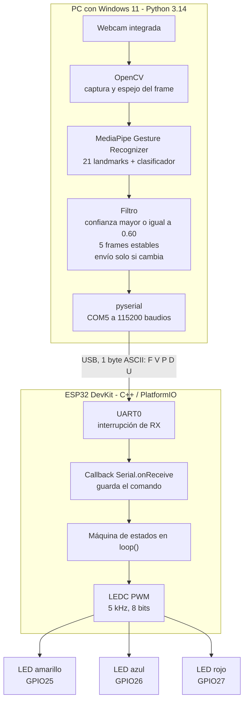
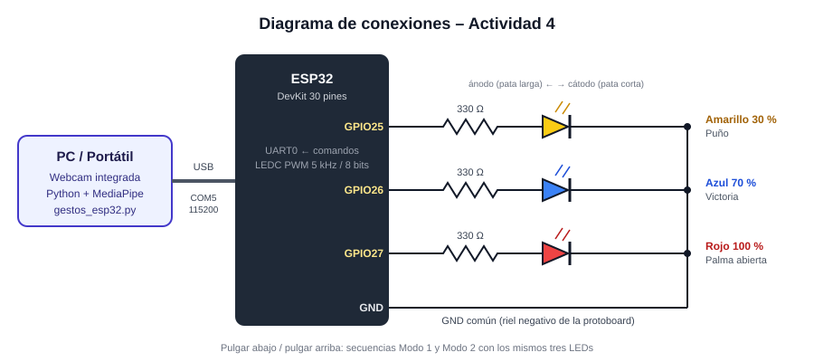
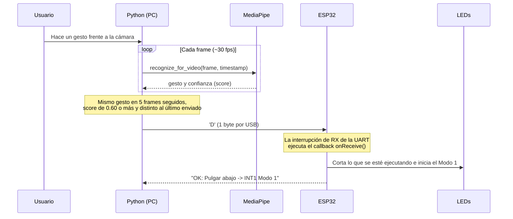
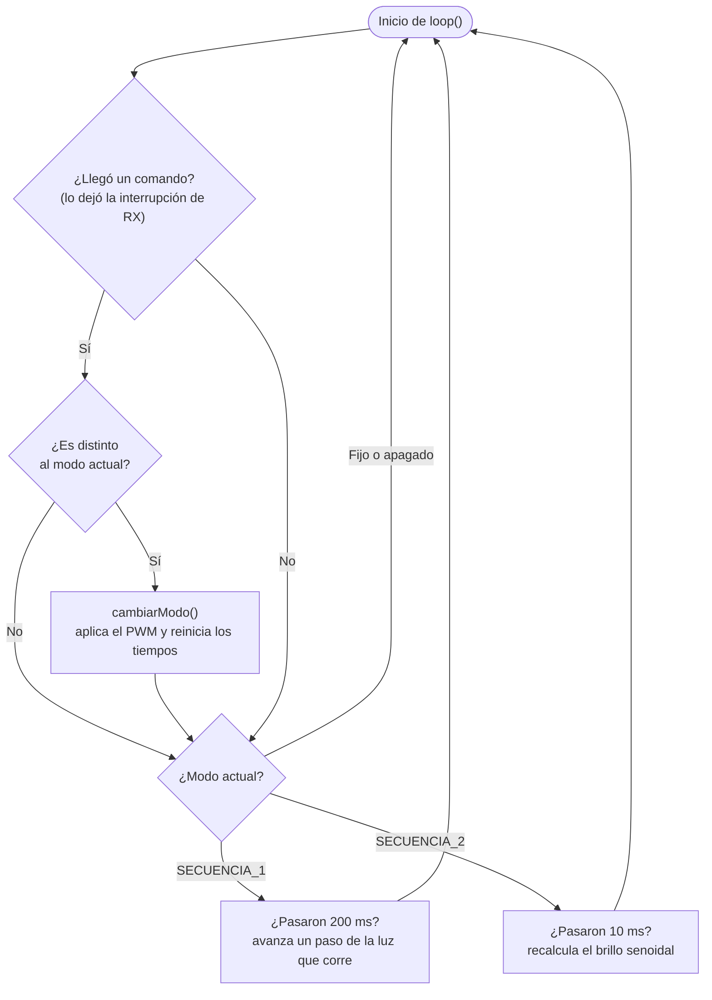

# Actividad 4 – Control de iluminación basado en gestos de la mano

**Universidad Militar Nueva Granada – Ingeniería Mecatrónica**<br>
**Asignatura:** Micros y Laboratorio<br>
**Autor:** Faber Alexander Rodriguez Hernandez<br>
**Código:** 7004488

Sistema que reconoce gestos de la mano con la librería **MediaPipe (Gesture Recognizer)** usando la webcam del PC y controla la intensidad y las secuencias de tres LEDs conectados a un **ESP32**.

| Gesto | Nombre en MediaPipe | Acción en el ESP32 |
|:---:|---|---|
| ✊ | `Closed_Fist` | LED **amarillo** al **30 %** de intensidad |
| ✌️ | `Victory` | LED **azul** al **70 %** de intensidad |
| 🖐️ | `Open_Palm` | LED **rojo** al **100 %** de intensidad |
| 👎 | `Thumb_Down` | **Primera interrupción** → secuencia de luces **Modo 1** |
| 👍 | `Thumb_Up` | **Segunda interrupción** → secuencia de luces **Modo 2** |

---

## Contenido

1. [Arquitectura del sistema](#1-arquitectura-del-sistema)
2. [Análisis del proyecto](#2-análisis-del-proyecto)
3. [Materiales y software](#3-materiales-y-software)
4. [Paso a paso para replicarlo](#4-paso-a-paso-para-replicarlo)
5. [Explicación del código](#5-explicación-del-código)
6. [Estructura del repositorio](#6-estructura-del-repositorio)
7. [Problemas comunes y soluciones](#7-problemas-comunes-y-soluciones)
8. [Conclusiones](#8-conclusiones)
9. [Referencias](#9-referencias)

---

## 1. Arquitectura del sistema

### 1.1 Diagrama de bloques

El reconocimiento de gestos se ejecuta en el PC, porque el modelo de MediaPipe necesita mucha más memoria y capacidad de cómputo de la que tiene el ESP32. El ESP32 recibe un solo carácter por el puerto serie y se encarga del control de los LEDs en tiempo real.



### 1.2 Diagrama de conexiones



| LED | Pin del ESP32 | Resistencia | Canal LEDC | Gesto |
|---|---|---|---|---|
| Amarillo | GPIO25 | 330 Ω | 0 | Puño (30 %) |
| Azul | GPIO26 | 330 Ω | 1 | Victoria (70 %) |
| Rojo | GPIO27 | 330 Ω | 2 | Palma abierta (100 %) |

Cada rama es: **GPIO → resistencia 330 Ω → ánodo (pata larga) → cátodo (pata corta) → GND**.

Se eligieron GPIO25, 26 y 27 porque son pines de propósito general que:

- no son pines de arranque (*strapping pins*) como el GPIO0, 2, 12 o 15;
- no están ligados a la memoria flash (GPIO6 a 11);
- sí admiten salida PWM.

### 1.3 Flujo de un gesto (de la cámara al LED)



### 1.4 Lógica del firmware (`loop()`)



| Estado | Comando | Salida |
|---|---|---|
| `APAGADO` | `X` (y estado inicial) | Los tres LEDs en 0 % |
| `AMARILLO_30` | `F` | Amarillo 30 %, azul y rojo apagados |
| `AZUL_70` | `V` | Azul 70 %, amarillo y rojo apagados |
| `ROJO_100` | `P` | Rojo 100 %, amarillo y azul apagados |
| `SECUENCIA_1` | `D` | Luz que corre, se repite hasta un comando nuevo |
| `SECUENCIA_2` | `U` | Respiración desfasada, se repite hasta un comando nuevo |

Desde cualquier estado se puede pasar a cualquier otro. Si llega el mismo comando que ya está activo, el estado no cambia y la secuencia no se reinicia.

---

## 2. Análisis del proyecto

### 2.1 Selección de la arquitectura

| Alternativa | Ventajas | Desventajas | Decisión |
|---|---|---|---|
| MediaPipe dentro del ESP32 | Todo en un solo dispositivo | El ESP32 (520 KB de SRAM, sin cámara ni aceleración) no puede ejecutar el modelo de manos a una velocidad útil | Descartada |
| Página web (JavaScript) + WiFi/WebSocket | Igual a la demo del enlace de la guía | Depende de la red WiFi (solo 2.4 GHz) y agrega latencia y puntos de falla | Descartada |
| **Python en el PC + USB Serial** | Estable, baja latencia, no necesita red, fácil de depurar con el monitor serie | Requiere el cable USB conectado | **Elegida** |

### 2.2 Reconocimiento de gestos con MediaPipe

El *Gesture Recognizer* de MediaPipe trabaja en tres etapas:

1. **Detector de palma:** ubica la mano en la imagen.
2. **Modelo de landmarks:** calcula los **21 puntos** de la mano (0 = `WRIST`, 4 = `THUMB_TIP`, 8 = `INDEX_FINGER_TIP`, 12 = `MIDDLE_FINGER_TIP`, 16 = `RING_FINGER_TIP`, 20 = `PINKY_TIP`, etc.), como se ve en la figura de la guía.
3. **Clasificador de gestos:** a partir de esos 21 puntos entrega una de las 8 categorías predefinidas: `None`, `Closed_Fist`, `Open_Palm`, `Pointing_Up`, `Thumb_Down`, `Thumb_Up`, `Victory` e `ILoveYou`.

Se usa el modo `VIDEO`. En este modo MediaPipe hace seguimiento (*tracking*) de la mano entre frames y no ejecuta el detector de palma en cada imagen, lo que reduce la latencia. Solo se usan cinco de las ocho categorías. `None`, `Pointing_Up` e `ILoveYou` se ignoran, y por eso **el sistema mantiene el último estado** cuando aparece un gesto no reconocido.

### 2.3 Protocolo de comunicación

Se diseñó un protocolo mínimo: **un byte ASCII por comando**, a 115200 baudios, 8N1.

| Byte | Significado | Respuesta del ESP32 |
|---|---|---|
| `F` | Puño | `OK: Puno -> Amarillo 30%` |
| `V` | Victoria | `OK: Victoria -> Azul 70%` |
| `P` | Palma abierta | `OK: Palma -> Rojo 100%` |
| `D` | Pulgar abajo | `OK: Pulgar abajo -> INT1 Modo 1` |
| `U` | Pulgar arriba | `OK: Pulgar arriba -> INT2 Modo 2` |
| `X` | Apagar (prueba manual) | `OK: Apagado` |

Transmitir un byte a 115200 baudios toma 10 bits / 115200 ≈ **87 µs**, así que el enlace serie no limita la respuesta del sistema. Como los comandos son letras, también se pueden probar escribiéndolas a mano en el monitor serie, sin cámara.

### 2.4 Robustez del reconocimiento

| Mecanismo | Valor | Para qué sirve |
|---|---|---|
| Umbral de confianza | `score ≥ 0.60` | Descarta clasificaciones dudosas |
| Anti-rebote | 5 frames seguidos (≈ 170 ms a 30 fps) | Evita que un gesto de transición (por ejemplo, al pasar de puño a palma) dispare un comando |
| Envío por cambio | Solo si el gesto es distinto al último enviado | No satura el puerto serie y no reinicia las secuencias |
| Sin mano o gesto desconocido | No se envía nada | Los LEDs mantienen el último estado |
| Apertura del puerto con DTR/RTS en bajo | `ser.dtr = ser.rts = False` | Evita que el ESP32 se reinicie al abrir el puerto |

### 2.5 Control de intensidad por PWM

La intensidad se controla con el periférico **LEDC** del ESP32 a **5 kHz** (muy por encima de lo que percibe el ojo, así que no hay parpadeo) y **8 bits** de resolución (duty de 0 a 255):

| Intensidad | Cálculo | Duty usado | Duty real |
|---|---|---|---|
| 30 % | 0.30 × 255 = 76.5 | 77 | 30.2 % |
| 70 % | 0.70 × 255 = 178.5 | 179 | 70.2 % |
| 100 % | 1.00 × 255 | 255 | 100 % |

El voltaje promedio en el pin es V = D × 3.3 V, es decir ≈ 1.0 V, 2.3 V y 3.3 V respectivamente. El LED en realidad se enciende y apaga 5000 veces por segundo, y el ojo percibe el promedio.

### 2.6 Cálculo de corriente en los LEDs

Con una salida de 3.3 V y resistencias de 330 Ω, la corriente con el LED al 100 % es I = (3.3 V − V<sub>f</sub>) / 330 Ω. Los V<sub>f</sub> de la tabla son valores típicos de LEDs de 5 mm:

| LED | V<sub>f</sub> típico | Corriente (100 %) |
|---|---|---|
| Rojo | ≈ 1.9 V | ≈ 4.2 mA |
| Amarillo | ≈ 2.0 V | ≈ 3.9 mA |
| Azul | ≈ 3.0 V | ≈ 0.9 mA |

Todas las corrientes están muy por debajo del límite recomendado por pin del ESP32 (≈ 20 mA), así que el circuito es seguro. El LED azul se ve más tenue porque su V<sub>f</sub> está cerca de 3.3 V. Si se quiere más brillo, se puede bajar solo su resistencia a 100–150 Ω.

### 2.7 Interrupciones y ejecución no bloqueante

La guía pide que el pulgar abajo y el pulgar arriba funcionen como **interrupciones**. Se implementó así:

- **Recepción por interrupción:** la llegada de datos a la UART0 genera una interrupción de hardware. El driver del ESP32 la atiende y ejecuta el callback registrado con `Serial.onReceive(alRecibirSerial)`. El `loop()` no tiene que preguntar si hay datos (*polling*); el callback deja el comando en una variable `volatile`.
- **Secuencias sin `delay()`:** los Modos 1 y 2 usan `millis()` para decidir cuándo avanzar. Así el `loop()` nunca se bloquea, y cuando llega un gesto nuevo la secuencia se **interrumpe en el mismo instante**, sin esperar a que termine un ciclo.
- **Repetición:** cada secuencia se repite indefinidamente hasta que llegue otro gesto.

### 2.8 Diseño de las secuencias

**Modo 1: pulgar abajo, "luz que corre".** Un solo LED encendido al 100 % que va y vuelve, cambiando cada 200 ms:

| Paso | Amarillo | Azul | Rojo |
|---|---|---|---|
| 0 | ● | ○ | ○ |
| 1 | ○ | ● | ○ |
| 2 | ○ | ○ | ● |
| 3 | ○ | ● | ○ |

**Modo 2: pulgar arriba, "respiración desfasada".** Cada LED sube y baja su brillo siguiendo una senoidal de periodo T = 1.5 s, desfasada 120° respecto al anterior. El resultado es una onda de luz que recorre los tres LEDs:

$$D_k(t) = 127.5\left[1 + \sin\left(\frac{2\pi t}{T} - k\,\frac{2\pi}{3}\right)\right], \qquad k = 0,1,2$$

El brillo se recalcula cada 10 ms (100 actualizaciones por segundo), lo que da una transición suave.

### 2.9 Resultados

- Los cinco gestos se reconocen con la webcam integrada del portátil y el cambio en los LEDs se ve **de inmediato** al hacer el gesto.
- Al hacer un gesto que el modelo no reconoce, o al retirar la mano, los LEDs **mantienen el último comando**, como se esperaba.
- Las secuencias se cortan en cuanto se hace un gesto distinto, gracias a la recepción por interrupción y al código no bloqueante.

---

## 3. Materiales y software

**Hardware**

- ESP32 DevKit V1 (30 pines)
- 3 LEDs de 5 mm: amarillo, azul y rojo
- 3 resistencias de 330 Ω
- Protoboard y cables de conexión
- Cable micro-USB de datos
- PC con webcam (se usó la integrada del portátil)

**Software**

| Herramienta | Versión usada | Uso |
|---|---|---|
| Windows | 11 | Sistema operativo |
| VS Code + PlatformIO | – | Compilar y cargar el firmware |
| Framework Arduino para ESP32 | plataforma `espressif32` | Firmware en C++ |
| Python | 3.14 | Script de visión |
| mediapipe | 1.0.1 | Reconocimiento de gestos (incluye OpenCV) |
| pyserial | 3.5 | Comunicación serial |
| Driver USB-UART (CP210x o CH340) | – | Para que Windows reconozca el ESP32 como puerto COM |

---

## 4. Paso a paso para replicarlo

### Paso 1: Clonar el repositorio

```bash
git clone https://github.com/faberx10/Actividad4.git
cd Actividad4
```

### Paso 2: Montar el circuito

Conectar los LEDs según el [diagrama de conexiones](#12-diagrama-de-conexiones): GPIO25, 26 y 27, cada uno con su resistencia de 330 Ω, y los cátodos al GND del ESP32.

### Paso 3: Cargar el firmware en el ESP32

1. Conectar el ESP32 por USB y verificar el puerto en el **Administrador de dispositivos** → *Puertos (COM y LPT)*. En este caso fue **COM5**; si es otro, cambiarlo en `firmware/platformio.ini`.
2. En VS Code: **PlatformIO → Open Project** → seleccionar la carpeta `firmware`.
3. Presionar **Upload** (→). Al arrancar, los tres LEDs prenden uno por uno como prueba.

### Paso 4: Probar el firmware sin cámara

1. Abrir el **Serial Monitor** de PlatformIO (115200 baudios).
2. Escribir `F`, `V`, `P`, `D`, `U` y `X` y verificar cada estado. El ESP32 responde con `OK: ...`.
3. **Cerrar el Serial Monitor.** Si queda abierto, el puerto sigue ocupado y el script de Python no se puede conectar.

### Paso 5: Preparar el entorno de Python

Desde la carpeta `vision`:

```powershell
py -3.14 -m venv .venv
.venv\Scripts\python.exe -m pip install -r requirements.txt
```

> No instalar `opencv-python` aparte. `mediapipe` ya instala `opencv-contrib-python`, y tener los dos genera conflicto.

### Paso 6: Probar solo la cámara

```powershell
.venv\Scripts\python.exe gestos_esp32.py --sin-serial
```

La primera ejecución descarga el modelo `gesture_recognizer.task`. Debe abrirse una ventana con los 21 landmarks de la mano y el gesto detectado.

### Paso 7: Ejecutar el sistema completo

```powershell
.venv\Scripts\python.exe gestos_esp32.py            # usa COM5 por defecto
.venv\Scripts\python.exe gestos_esp32.py --port COM7  # si el puerto es otro
```

Hacer cada gesto y sostenerlo un momento. Para salir, presionar `q` o `ESC`.

---

## 5. Explicación del código

### 5.1 Firmware: `firmware/src/main.cpp`

**a) Pines, PWM y duty cycles.** Se definen los pines de cada LED, la frecuencia y resolución del PWM y los valores de duty para 30 %, 70 % y 100 %.

```cpp
const uint8_t PIN_AMARILLO = 25;
const uint8_t PIN_AZUL     = 26;
const uint8_t PIN_ROJO     = 27;

const uint32_t PWM_FREQ = 5000;  // Hz
const uint8_t  PWM_RES  = 8;     // bits -> duty 0..255

const uint8_t DUTY_30  = 77;   // 0.30 * 255
const uint8_t DUTY_70  = 179;  // 0.70 * 255
const uint8_t DUTY_100 = 255;
```

**b) Compatibilidad de la API LEDC.** El framework Arduino para ESP32 cambió las funciones de PWM entre la versión 2.x (`ledcSetup` + `ledcAttachPin`, por canal) y la 3.x (`ledcAttach`, por pin). Con directivas del preprocesador el mismo código compila en ambas versiones:

```cpp
#if defined(ESP_ARDUINO_VERSION_MAJOR) && ESP_ARDUINO_VERSION_MAJOR >= 3
  void pwmInit(uint8_t pin, uint8_t) { ledcAttach(pin, PWM_FREQ, PWM_RES); }
  void pwmWrite(uint8_t pin, uint8_t, uint8_t duty) { ledcWrite(pin, duty); }
#else
  void pwmInit(uint8_t pin, uint8_t ch) { ledcSetup(ch, PWM_FREQ, PWM_RES); ledcAttachPin(pin, ch); }
  void pwmWrite(uint8_t, uint8_t ch, uint8_t duty) { ledcWrite(ch, duty); }
#endif
```

**c) Recepción por interrupción.** El callback se ejecuta cuando la UART recibe datos. Solo acepta letras válidas y guarda la última en una variable `volatile`, porque esa variable se comparte con el `loop()`.

```cpp
volatile char comandoPendiente = 0;

void alRecibirSerial() {
  while (Serial.available()) {
    char c = toupper(Serial.read());
    if (c == 'F' || c == 'V' || c == 'P' || c == 'D' || c == 'U' || c == 'X') {
      comandoPendiente = c;
    }
  }
}
// En setup():  Serial.onReceive(alRecibirSerial);
```

**d) Máquina de estados.** `cambiarModo()` aplica el nuevo estado y reinicia los contadores de tiempo de las secuencias. Si el comando es el mismo que ya está activo, no hace nada, así una secuencia no se reinicia si llega el mismo gesto dos veces.

```cpp
enum Modo { APAGADO, AMARILLO_30, AZUL_70, ROJO_100, SECUENCIA_1, SECUENCIA_2 };

void cambiarModo(Modo nuevo) {
  if (nuevo == modoActual) return;
  modoActual = nuevo;
  pasoSecuencia = 0;
  tInicioSecuencia = tUltimoPaso = millis();
  switch (modoActual) {
    case AMARILLO_30: setLeds(DUTY_30, 0, 0);  ... break;
    case AZUL_70:     setLeds(0, DUTY_70, 0);  ... break;
    case ROJO_100:    setLeds(0, 0, DUTY_100); ... break;
    ...
  }
}
```

**e) Secuencia Modo 1 (no bloqueante).** Recorre una tabla de 4 pasos. Solo avanza cuando han pasado 200 ms desde el último paso, medidos con `millis()`:

```cpp
void secuenciaModo1() {
  const unsigned long PASO_MS = 200;
  const uint8_t patron[4][3] = {
    {DUTY_100, 0, 0}, {0, DUTY_100, 0}, {0, 0, DUTY_100}, {0, DUTY_100, 0},
  };
  if (millis() - tUltimoPaso >= PASO_MS) {
    tUltimoPaso = millis();
    setLeds(patron[pasoSecuencia][0], patron[pasoSecuencia][1], patron[pasoSecuencia][2]);
    pasoSecuencia = (pasoSecuencia + 1) % 4;
  }
}
```

**f) Secuencia Modo 2.** Aplica la ecuación de la sección 2.8 con tres senoidales desfasadas 2π/3:

```cpp
float fase = TWO_PI * (float)(millis() - tInicioSecuencia) / PERIODO_MS;
uint8_t a = (uint8_t)(127.5f * (1.0f + sinf(fase)));
uint8_t b = (uint8_t)(127.5f * (1.0f + sinf(fase - TWO_PI / 3.0f)));
uint8_t r = (uint8_t)(127.5f * (1.0f + sinf(fase - 2.0f * TWO_PI / 3.0f)));
setLeds(a, b, r);
```

**g) `loop()`.** Primero atiende el comando que dejó la interrupción y después avanza la secuencia activa. Como nada bloquea, el ciclo se repite miles de veces por segundo.

```cpp
void loop() {
  if (comandoPendiente) {
    char c = comandoPendiente;
    comandoPendiente = 0;
    switch (c) { case 'F': cambiarModo(AMARILLO_30); break; ... }
  }
  if (modoActual == SECUENCIA_1) secuenciaModo1();
  else if (modoActual == SECUENCIA_2) secuenciaModo2();
}
```

### 5.2 Visión: `vision/gestos_esp32.py`

**a) Tabla de gestos.** Relaciona cada categoría de MediaPipe con el byte que se envía y el texto que se muestra en pantalla:

```python
GESTOS = {
    "Closed_Fist": ("F", "Puno -> Amarillo 30%"),
    "Victory":     ("V", "Victoria -> Azul 70%"),
    "Open_Palm":   ("P", "Palma -> Rojo 100%"),
    "Thumb_Down":  ("D", "Pulgar abajo -> Modo 1"),
    "Thumb_Up":    ("U", "Pulgar arriba -> Modo 2"),
}
SCORE_MIN = 0.60
FRAMES_ESTABLES = 5
```

**b) Apertura del puerto sin reiniciar el ESP32.** En el DevKit, las líneas DTR y RTS del conversor USB-UART están conectadas a los pines EN y GPIO0. Si el puerto se abre con esas líneas activas, el ESP32 se reinicia. Por eso se ponen en `False` antes de abrirlo:

```python
ser = serial.Serial()
ser.port = puerto
ser.baudrate = 115200
ser.dtr = False
ser.rts = False
ser.open()
```

**c) Creación del reconocedor.** Se usa el modo `VIDEO`, que aprovecha el seguimiento entre frames, y hasta 2 manos, porque la guía muestra dos palmas para el 100 %:

```python
opciones = vision.GestureRecognizerOptions(
    base_options=BaseOptions(model_asset_path=MODEL_PATH),
    running_mode=vision.RunningMode.VIDEO,
    num_hands=2,
)
```

**d) Procesamiento de cada frame.** OpenCV entrega la imagen en BGR y MediaPipe la necesita en RGB. Además, el modo `VIDEO` exige una marca de tiempo en milisegundos que siempre sea creciente:

```python
rgb = cv2.cvtColor(frame, cv2.COLOR_BGR2RGB)
imagen = mp.Image(image_format=mp.ImageFormat.SRGB, data=rgb)
resultado = reconocedor.recognize_for_video(imagen, ts)
```

**e) Selección del gesto y anti-rebote.** Entre las manos detectadas se toma el gesto válido de mayor confianza. Solo se envía cuando se repite `FRAMES_ESTABLES` veces seguidas y es distinto al último enviado:

```python
if gesto is not None and gesto == candidato:
    conteo += 1
else:
    candidato, conteo = gesto, 1 if gesto else 0

if candidato and conteo == FRAMES_ESTABLES and candidato != ultimo_enviado:
    cmd, texto_estado = GESTOS[candidato]
    ser.write(cmd.encode())
    ultimo_enviado = candidato
```

**f) Interfaz.** Sobre la imagen se dibujan los 21 landmarks numerados con sus conexiones, el gesto detectado, el estado de los LEDs y la última respuesta del ESP32.

---

## 6. Estructura del repositorio

```
Actividad4/
├── README.md               ← este documento
├── .gitignore
├── docs/
│   └── conexiones.svg      ← diagrama de conexiones
├── firmware/               ← proyecto PlatformIO (ESP32, C++)
│   ├── platformio.ini
│   └── src/
│       └── main.cpp
└── vision/                 ← script de reconocimiento (Python)
    ├── gestos_esp32.py
    └── requirements.txt
```

El modelo `gesture_recognizer.task` no se sube al repositorio: el script lo descarga automáticamente la primera vez que se ejecuta.

---

## 7. Problemas comunes y soluciones

| Problema | Causa | Solución |
|---|---|---|
| `No se pudo abrir COM5: Access denied` | El Serial Monitor está abierto | Cerrar el monitor de PlatformIO o de Arduino IDE |
| El ESP32 no aparece como puerto COM | Falta el driver USB-UART, o el cable es solo de carga | Instalar el driver CP210x o CH340; usar un cable de datos |
| `No se pudo abrir la cámara` | Otra aplicación está usando la webcam | Cerrar Teams, Zoom, etc., o probar con `--cam 1` |
| El LED azul se ve muy tenue | V<sub>f</sub> ≈ 3 V, cerca de los 3.3 V de la salida | Bajar solo su resistencia a 100–150 Ω |
| Error de pip con `cv2` duplicado | Se instaló `opencv-python` además del de MediaPipe | `pip uninstall opencv-python` |
| Un gesto no se reconoce bien | Poca luz o la mano muy lejos | Mejorar la iluminación y mostrar la mano completa frente a la cámara |

---

## 8. Conclusiones

- Separar el sistema en dos niveles funcionó bien: el PC hace la visión artificial, que es lo pesado, y el ESP32 hace el control en tiempo real. Así cada dispositivo se usa en lo que hace mejor.
- Un protocolo de un solo byte es suficiente para este problema. Además, permite probar el firmware sin cámara desde el monitor serie, lo que facilitó la depuración.
- La recepción serial por interrupción, junto con secuencias escritas con `millis()` en vez de `delay()`, permite que cualquier gesto corte una secuencia al instante.
- El umbral de confianza y el anti-rebote por frames eliminaron los cambios falsos que aparecen en las transiciones entre gestos. Ignorar las clases no usadas hace que el sistema conserve su último estado.
- El PWM del periférico LEDC controla la intensidad con precisión: 30 %, 70 % y 100 % corresponden a duty de 77, 179 y 255 con 8 bits.

---

## 9. Referencias

- Google AI Edge. *MediaPipe Gesture Recognizer – demo web.* https://google-ai-edge.github.io/mediapipe-samples-web/#/vision/gesture_recognizer
- Google AI Edge. *Gesture recognition guide for Python.* https://ai.google.dev/edge/mediapipe/solutions/vision/gesture_recognizer/python
- Espressif Systems. *ESP32 Arduino Core – LEDC (PWM).* https://docs.espressif.com/projects/arduino-esp32/en/latest/api/ledc.html
- Espressif Systems. *ESP32 Arduino Core – Serial (UART).* https://docs.espressif.com/projects/arduino-esp32/en/latest/api/serial.html
- pySerial documentation. https://pyserial.readthedocs.io/
